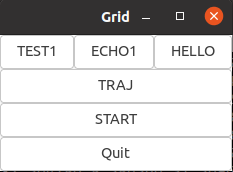

# machytech-gui

code used for the graphical user interface.

## getting started
```
pip install requirements.txt
python run.py
```
> native applications

We have a gtk application with which you can easily test machytech backend code. You need to copy the machyapi.h header-only library into machy-api directory and you are able to compile with the makefile.



### git submodules
<- DEPR ->
We are using jsvideo libraries. Check the repository on how to compile.
```
git submodule update --init --recursive
```
alternatively use the web libraries.
```
<script src="https://unpkg.com/video.js/dist/video.js"></script>
<script src="https://unpkg.com/@videojs/http-streaming/dist/videojs-http-streaming.js"></script>
```
## Docker container

use the dockerfile in repository.
```
docker build image -t machytech-ui .
```
then run the image in a container
```
docker run -dp 5000:5000 machytech-ui
```
remove old images....
```
docker image rm --force machytech-ui:latest
```
stop the container with the name in docker ls.
```
docker stop name
```
## hls streaming

Install the service file as systemd service 
```
cp machyhls.service /etc/systemd/system/
cp starthls.sh /usr/local/bin/
systemctl enable machyhls.service && systemctl start machyhls.service
```
